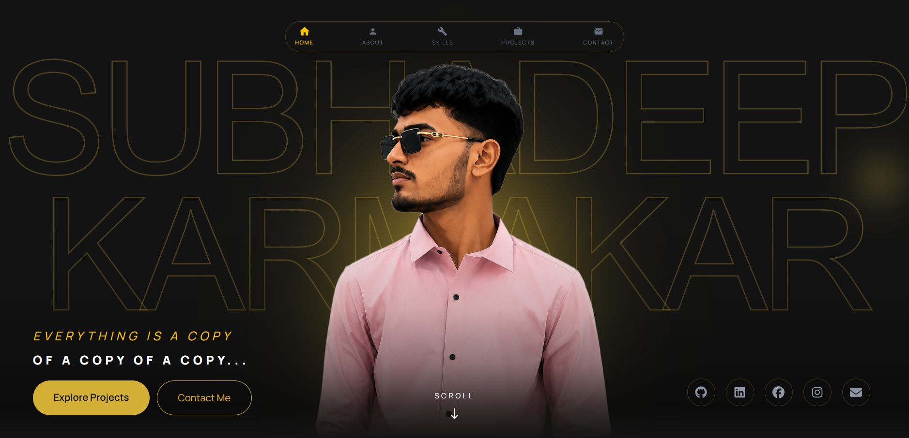
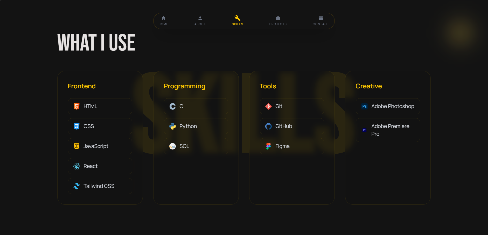
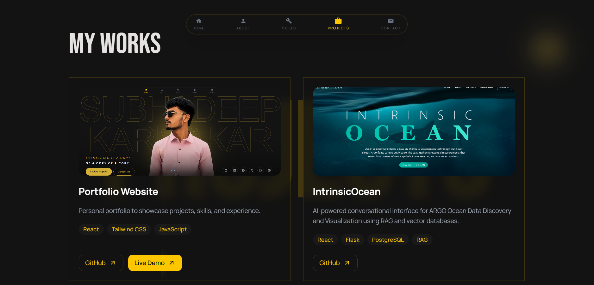
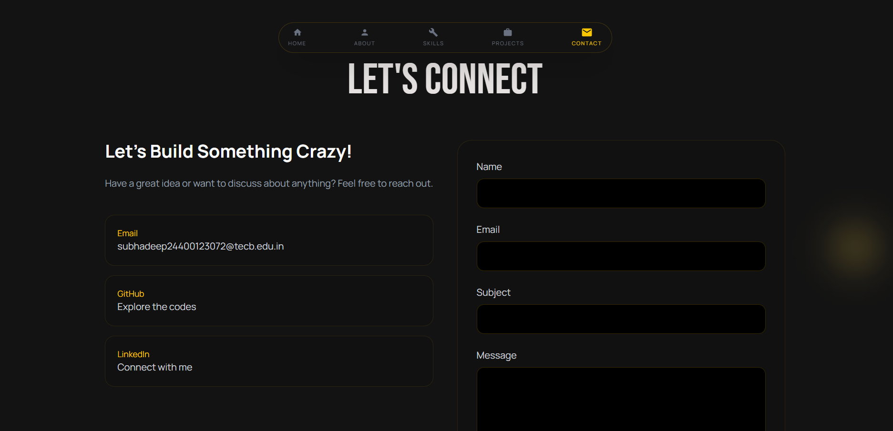

# 🚀 Personal Portfolio

A modern and responsive portfolio website built with React, Tailwind CSS, and Framer Motion to showcase projects, skills, and experience.

## 🌐 Live Demo

🔗 https://subhadeep-dev.vercel.app/

---

## ✨ Features

- Modern UI/UX Design
- Fully Responsive Layout
- Smooth Animations
- Interactive Skills Section
- Project Showcase
- Contact Form using EmailJS
- Mobile Friendly
- Fast Deployment with Vercel

---

## 🛠 Tech Stack

### Frontend
- React
- JavaScript
- Tailwind CSS
- Framer Motion

### Tools
- Git
- GitHub
- Vite
- Vercel

### Services
- EmailJS

---

## 📸 Screenshots

### Hero Section


### Skills Section


### Projects Section


### Contact Section


---

## 🚀 Installation

```bash
git clone https://github.com/SubhadeepK-62/Portfolio.git
cd Portfolio
npm install
npm run dev
```

---

## 📂 Project Structure

```text
Portfolio/
│
├── public/
├── screenshots/
├── src/
│   ├── assets/
│   ├── components/
│   ├── context/
│   ├── data/
│   ├── hooks/
│   ├── App.jsx
│   └── main.jsx
│
├── .env
├── index.html
├── package.json
├── vite.config.js
└── README.md
```

---

## 📬 Contact

📧 Email: subhadeep24400123072@tecb.edu.in

💼 LinkedIn: https://linkedin.com/in/subhadeepkarmakar

🌐 Portfolio: https://subhadeep-dev.vercel.app/

---

## 👨‍💻 Author

**Subhadeep Karmakar**

B.Tech CSE Student | Frontend Developer 